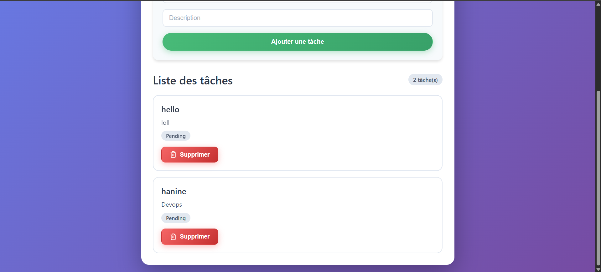

# Lab-Docker-Compose 🐳

Application Todo List complète avec Docker Compose : React.js, Node.js/Express et MySQL.

## 📋 Table des matières
- [Aperçu](#aperçu)
- [Fonctionnalités](#fonctionnalités)
- [Technologies utilisées](#technologies-utilisées)
- [Prérequis](#prérequis)
- [Installation et lancement](#installation-et-lancement)
- [Structure du projet](#structure-du-projet)
- [API Endpoints](#api-endpoints)
- [Captures d'écran](#captures-décran)
- [Dépannage](#dépannage)
- [Commandes utiles](#commandes-utiles)
- [Auteur](#auteur)

## 🎯 Aperçu

Ce projet est une application de gestion de tâches (Todo List) conteneurisée avec Docker Compose. Elle démontre comment orchestrer trois services :
- **Frontend** : Application React servie par Nginx
- **Backend** : API REST avec Node.js/Express
- **Base de données** : MySQL pour la persistance des données

L'application permet de créer, lister et supprimer des tâches avec une interface moderne et responsive.

## ✨ Fonctionnalités

- ✅ **Ajouter** une nouvelle tâche (titre + description)
- ✅ **Lister** toutes les tâches existantes
- ✅ **Supprimer** une tâche
- ✅ **Statut** des tâches (pending/completed)
- ✅ **Interface moderne** et responsive avec animations CSS
- ✅ **Santé de l'application** : vérification de la connexion à la base de données
- ✅ **Dockerisation complète** avec gestion des réseaux et volumes
- ✅ **Persistance des données** avec volume Docker
- ✅ **Variables d'environnement** pour la configuration

## 🛠 Technologies utilisées

| Service | Technologie | Version |
|---------|------------|---------|
| Frontend | React.js | 18.2.0 |
| Backend | Node.js/Express | 20-alpine |
| Base de données | MySQL | 8.4.8 |
| Serveur web | Nginx | Alpine |
| Conteneurisation | Docker Compose | 3.x |
| Langage | JavaScript | ES6+ |
| HTTP Client | Axios | 1.6.2 |

## 📦 Prérequis

- [Docker Desktop](https://www.docker.com/products/docker-desktop/) (version 20.10+)
- [Git](https://git-scm.com/) (optionnel, pour cloner)
- 2-4 Go d'espace disque disponible
- Connexion internet pour le premier build
- WSL2 (pour Windows) ou système Linux/Mac

## 🚀 Installation et lancement

### 1. Cloner le projet
git clone https://github.com/HanineRMD/Lab-Docker-Compose.git
cd Lab-Docker-Compose

📸 Captures d'écran
Page d'accueil avec la liste des tâches

Capture d'écran 1 : Interface principale de l'application avec le formulaire d'ajout, le bouton de test de connexion et la liste des tâches

Exemple d'utilisation avec tâches ajoutées

Capture d'écran 2 : Affichage des tâches avec les boutons de suppression, le compteur de tâches et le design moderne avec dégradés

👩‍💻 Auteur
HanineRMD

GitHub : @HanineRMD

Projet : Lab-Docker-Compose
